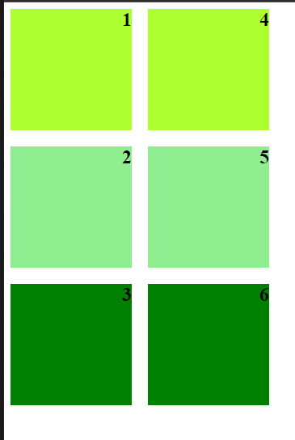
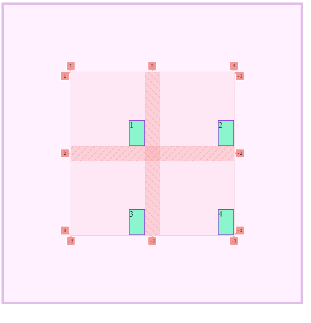
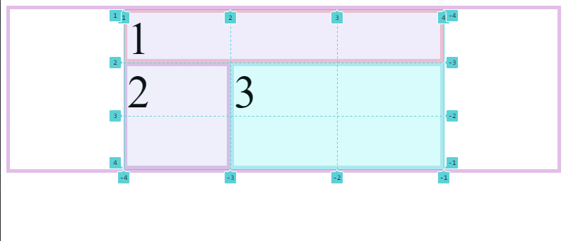
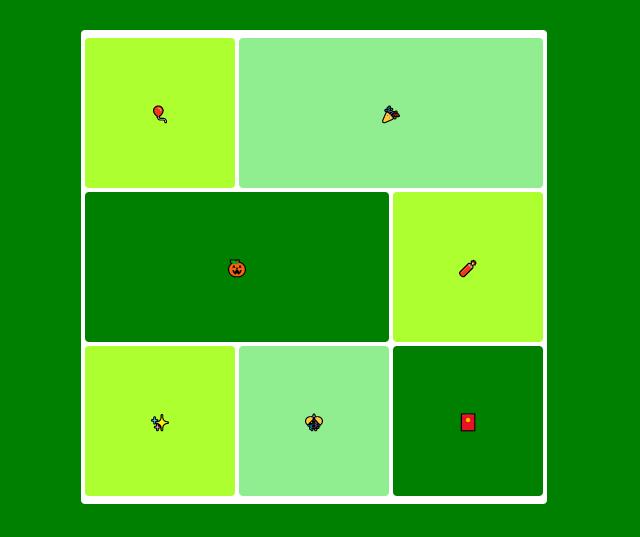
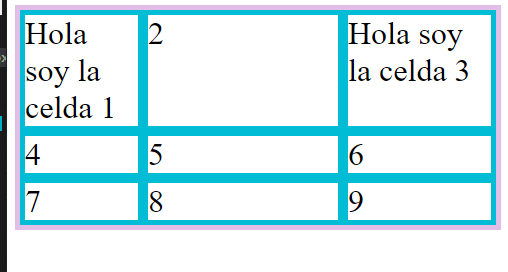
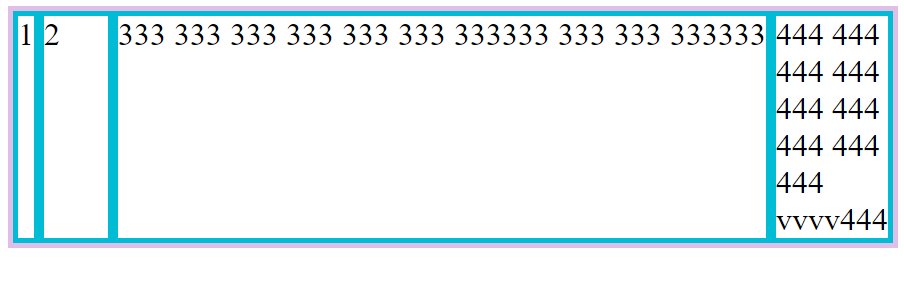
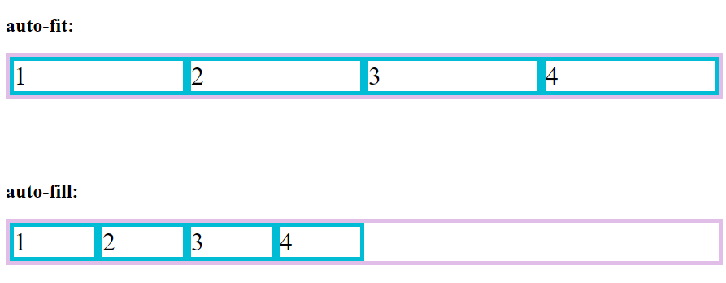

# Curso Básico de CSS Grid.

- Construye layouts complejos de manera sencilla y responsiva
- Posiciona ítems y contenedores
- Controla ítems a través de filas y columnas
- Distingue las diferentes propiedades de CSS Grid

## Práctica 2: Conceptos básicos

- **Container:** Es un contenedor donde se almacenan los elementos
- **Item:** Son los elementos que estan en el contenedor y se convierten en Grid Item pueden ser (botones,links,imagenes y videos)
- **Lineas :** Son los elementos que dividen las filas y columnas de una Grilla
- Celda: Es la unidad minima que tenemos en una Grilla, esta delimitada por 4 lineas. Ocupa 1 columna, 1 Fila
- **Track:** Los track son un grupo de celdas que estan en una misma fila o una misma columna
- **Area:** Pueden usar varias filas o varias columnas al mismo tiempo

##  Práctica 3: Propiedades del Contenedor
*Display: Grid
*Grid-template
*Gaps
*Grid-auto
### Reto de la clase
- Crear un grid de 3 filas y 3 columnas con un gap de 20px entre ellas.

##  Práctica 4: Propiedades de alineación
- Alineación a los items
	- Justify-items
	- align-items
	- place-items
- Alineación a contenedor completo en conjunto:
	- justify-content
	- align-content
	- place-content
- Alineación individual a los hijos de la grilla.
	- justify-selft
	- align-selft
	- place-selft

### Reto de la clase:
- Crear un grid de 2x2 donde los items se ubiquen en la esquina inferior derecha del contenedor, el contenedor debe estar centrado.

## Práctica 5: Propiedades de ubicación
- Ubicación en las columnas:
	- grid-column-start
	- grid-column-end
	- grid-column (engloba las dos anteriores)
- Ubicacion en las filas / Rows
	- grid-row-start
	- grid-row-end
	- grid-row   (engloba las dos anteriores)
- Ubicación por nombre:
	- grid-area:
### Ejercicio:

### Reto:
Arma la grilla con posiciones específicas solicitadas.

## Práctica 6: Funciones Especiales
- minmax: ayuda a declarar el tamaño minimo y maximo para el ancho y alto de una celda, sin depender del contenido que tengamos en ella.
- repeat : se usa cuando todas las columnas o filas tienen el msmo ancho y evitar repetir el tamaño de las columnas.
### Ejercicio

## Práctica 7: Kewords especiales
- fr : Es una unidad de medida especial de css grid para darle ancho o alto a filas y columnas 1fr representa una fraccion del total de columnas o filas.
- min-content : Ajusta el ancho de la celda lo mínimo posible sin romper su contenido.
- max-content : Ajusta el ancho de la celda lo máximo posible para mostrar su contenido.
- auto-fill : Agrega columnas “fantasma” que rellenan el espacio sobrante del contenedor.
- auto-fit : Ensancha las columnas para que ocupen todo el espacio del contenedor.
- auto-fill y auto-fit ayudan a la grilla a ocupar el 100% del espacio disponible.
### Ejercicio:
min-content y max-content

## Práctica 8: Proyecto